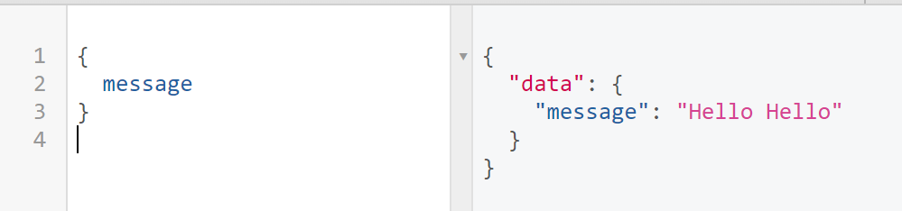

# graphql-reference

- A traditional method to call for data sometimes involve making several API calls to your server to query for more information that what is needed.
- GraphQL - Make a single API call to query for specfically needed information from your Node / Express server.

## Setup

- `npm install express express-graphql`
- Define schema of how all of data interacts together and pass into GraphQL.

```javascript
const express = require("express");
const expressGraphQL = require("express-graphql");
const { GraphQLSchema, GraphQLObjectType, GraphQLString } = require("graphql");

const PORT = 5000;

const app = express();

// create schema
const schema = new GraphQLSchema({
  // example model: create an object that will query for an object called { name: "Hello" }
  // the object has a field called message
  query: new GraphQLObjectType({
    name: "Hello",
    fields: () => ({
      message: {
        // define the type of the message
        type: GraphQLString, // define data type of this message
        resolve: () => "Hello Hello" // tells graphql where to get the information
      }
    })
  })
});

// pass in an object containing the schema and UI to graphql
// this gives access to graphql's interface to interact with the API
app.use(
  "/",
  expressGraphQL({
    schema: schema,
    // UI for graphql
    graphiql: true
  })
);

app.listen(PORT, () => console.log(`GraphQL server is running on: ${PORT}`));
```



```javascript
{
    "errors": [ { "message": "GraphQL middleware options must contain a schema." } ]
}
```

> no valid schema
